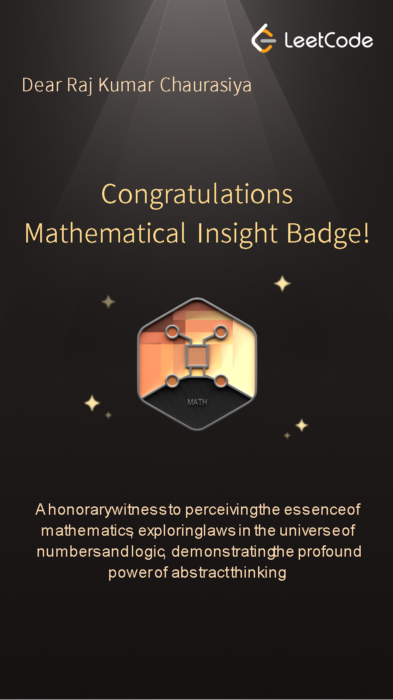
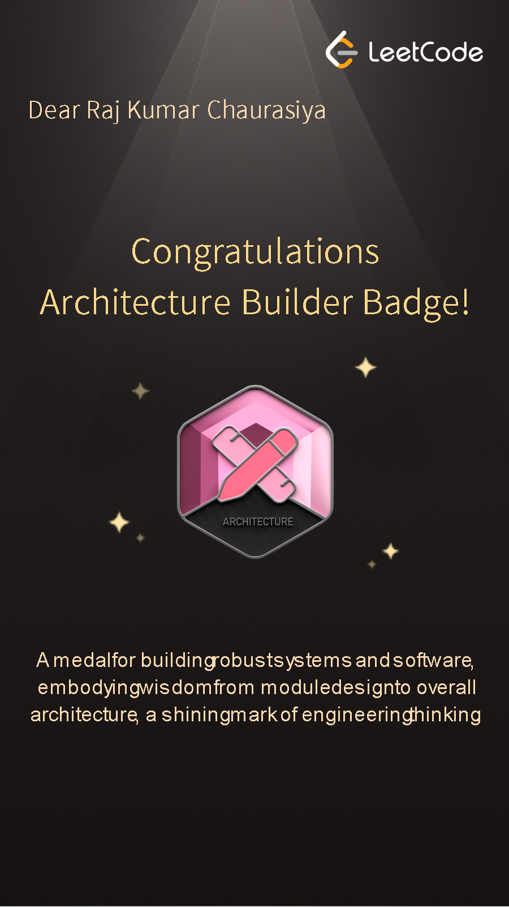

# 🚀 LeetCode Journey – Raj Kumar Chaurasiya

Welcome to my **LeetCode Profile Showcase Repository**!  
This repository highlights my problem-solving journey, achievements, and badges earned on **LeetCode**, reflecting my continuous effort to improve in **Data Structures, Algorithms, Mathematics, and Software Architecture**.

---

## 👤 About Me

Hi, I'm **Raj Kumar Chaurasiya**, a **MERN Stack Developer** with experience in:

- React.js, Node.js, Express.js, MongoDB
- Backend API development
- Frontend UI/UX design
- Problem-solving & algorithmic thinking

I actively practice **DSA on LeetCode** to strengthen my logical thinking and coding efficiency.

🔗 **LeetCode Profile:**  
👉 https://leetcode.com/u/RajKumarChaurasiya/

---

## 📊 LeetCode Statistics (Snapshot)

- **Total Problems Solved:** 228+
- **Easy:** 97+
- **Medium:** 90+
- **Hard:** 41+
- **Contest Rating:** 1487
- **Badges Earned:** 2
- **Active Coding Streak:** 29 days (max)

---

## 🏆 Achievements & Badges

### 🧮 Mathematical Insight Badge

Awarded for demonstrating strong analytical skills and deep understanding of mathematical concepts applied to problem-solving.

> *“An honorary witness to perceiving the essence of mathematics, exploring laws in the universe of numbers and logic, and demonstrating the profound power of abstract thinking.”*

---

### 🏗️ Architecture Builder Badge

Recognizes the ability to design scalable, robust, and well-structured software systems.

> *“A medal for building robust systems and software, embodying wisdom from module design to overall architecture — a shining mark of engineering thinking.”*

---

## 📸 LeetCode Profile Overview

A snapshot of my LeetCode dashboard showcasing rankings, solved problems, and activity.

---

## 🎯 Goals

- Solve **500+ LeetCode problems**
- Improve **contest rating**
- Master **Advanced DSA & System Design**
- Apply algorithmic thinking in real-world projects

---

## 🛠️ Tech Stack

- **Languages:** JavaScript, C++, Python
- **Frontend:** React.js, HTML, CSS
- **Backend:** Node.js, Express.js
- **Database:** MongoDB
- **Tools:** Git, GitHub, LeetCode

---

## 🤝 Connect With Me

- 💼 **LinkedIn:** (https://www.linkedin.com/in/raj-kumar-chaurasiya-9a74b231b/)
- 🧑‍💻 **GitHub:** https://github.com/Raj-Kumar-Chaurasiya/LeetCode-Profile
- 🧠 **LeetCode:** https://leetcode.com/u/RajKumarChaurasiya/

---

## ⭐ Support

If you find this repository inspiring:
- Give it a ⭐
- Fork it
- Share your own LeetCode journey!

---

**Happy Coding! 🚀**
